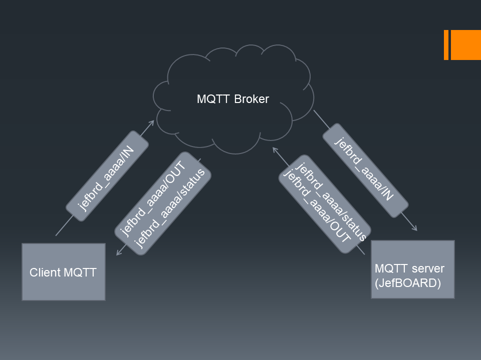

# MQTT Server

## Cos'è
E' un dispositivo che permette il controllo remoto degli input/output di un microcontroller (in questo caso l'Attiny2313) tramite il protocollo MQTT.
Per saperne di più sul protocollo MQTT:

https://mqtt.org/ 

## Principio di funzionamento
Questo progetto è basato sulla scheda JefBoard che ospita a bordo un microcontroller Attiny2313 e il modulo WIFI ESP01 (https://github.com/jef238/jefBoard). Il modulo ESP01 consentirà la comunicazione verso il broker MQTT e verso l'Attiny2313, si occuperà inoltre di fornire un interfaccia per la configurazione della connessione WIFI. La comunicazione SERIALE integrata in JefBoard tra l'ESP01 e l'Attiny2313 consentirà la ricezione o l'invio dei comandi verso gli specifici TOPICS MQTT.



Il protocollo MQTT permette di utilizzare topics differenti per gestire le comunicazioni con il microcontroller, in particolare:

- **jbrd_idunivoco/status** -> Viene utilizzato per comunicare informazioni circa lo stato di funzionamento del sistema
- **jbrd_idunivoco/IN** -> Tutti i comandi da inviare verso il microcontroller (JefBoard)
- **jbrd_idunivoco/OUT** ->Tutti gli output in uscita dal microcontroller (JefBoard)

Nota: idunivoco viene generato a partire dagli ultimi 4 caratteri del macaddress dell'ESP01 (vedi init.lua).
- Esempio: **jefbrd_8bdd**
- Esempio di topic completo: **jefbrd_8bdd/status**

## Formato dei comandi
Nel protocollo MQTT il contenuto del messaggio scambiato tra il client ed il broker è chiamato payload e può contenere 
qualsiasi tipo di dato binario come testo, XML, JSON immagini ecc.ec.. In questo caso utilizzeremo dei messaggi costituiti da stringhe che iniziano con il carattere * e terminano con il carattere #.

Esempio: *PD51#

La lunghezza complessiva di tale comando esclusi i caratteri * e # sarà di 8 caratteri (ma è modificabile)

## Codice ESP01 (LUA scripts)
Il firmware da caricare su ESP01 è **nodeMCU** compilato con i moduli opzionali ENDUSR e MQTT che forniscono rispettivamente il modulo per l'autoconfigurazione del WIFI e il supporto al protocollo MQTT (nodemcu-release-ENDUSR_MQTT-integer.bin vedi su questo repo); Per informazioni su come eseguire il flash del firmware vedi https://github.com/jef238/jefBoard.

Una volta caricato il firmware nodeMCU è possibile caricare gli script LUA. Il file denominato init.lua viene caricato all'avvio in maniera automatica. E' possibile utilizzare il software **ESPlorer** (https://github.com/4refr0nt/ESPlorer) sia per caricare sia gli script LUA che per gestire al meglio l'ESP01.
ATTENZIONE: Il codice contenuto nel file init.lua attiva una funzione di callback sulla seriale per consentire lo scambio di informazioni bidirezionale verso l'Attiny2313 dopo 10 secondi dall'avvio. Dopo non sarà più possibile utilizzare tool di gestione dell'ESP01 come ESPlorer che utilizzano appunto la seriale. In questo range di 10 secondi è possibile sostituire e/o modificare l'init.lua per ritornare ad utilizzare ESPlorer.

Per eseguire i test utilizzeremo un broker MQTT demo di test **broker.hivemq.com**.

Inoltre nel file init.lua è stato inserita la possibilità di resettare le impostazioni WIFI precedentemente salvate portando a massa il pin **GPI00** dell'ESP01.

I file da caricare su ESP01 saranno due, **init.lua** e **mqtt.lua**:

### init.lua

```
-- jefBoard ESP01 vers. 1.0

uart.setup(0, 9600, 8, uart.PARITY_NONE, uart.STOPBITS_1, 1)

print("\n\nJefBoard is loading...")
print("\n10 seconds to activate ESP01 serial input callback to MQTT")

wifi.sta.autoconnect(1)

uid = string.sub(wifi.sta.getmac(),-5)
uid = string.gsub(uid,":","")

function main()

dofile("mqtt.lua")

end

enduser_setup.start("jefBoard_" .. uid, main)

function clearC()
wifi.sta.clearconfig()
end

gpio.mode(3, gpio.INT)
gpio.trig(3, "down", clearC)

--Attendi 10 secondi prima di attivare callback dell'input seriale dell'esp01 to-> mqtt
--In questo range è ancora possibile utilizzare ESPlorer e disabilitare il callback decommentando
--uart.on("data")

tmr.create():alarm(10000, tmr.ALARM_SINGLE, function()

uart.on("data", "#",
  function(data)
   m:publish("jbrd_" .. uid .. "/OUT", data, 0, 0)
  end, 
  0)
  
end)

--uart.on("data")
```
### mqtt.lua

```
-- init mqtt client with logins, keepalive timer 120sec

m = mqtt.Client("jbrd" .. uid, 120)

-- setup Last Will and Testament (optional)
-- Broker will publish a message with qos = 0, retain = 0, data = "offline"
-- to topic "/lwt" if client don't send keepalive packet
m:lwt("/lwt", "offline", 0, 0)

m:on("offline", function(client)
  print ("offline")
  do_mqtt_connect()
end)

-- on publish message receive event FROM jefboard attiny2313 
m:on("message", function(client, topic, data)  
  if data ~= nil then
    --send topic subscribed data to serial -> attiny2313
    print(data)   
  end
end)

-- on publish overflow receive event
m:on("overflow", function(client, topic, data)
  print(topic .. " partial overflowed message: " .. data )
end)


function handle_mqtt_error(client, reason)
  tmr.create():alarm(10 * 1000, tmr.ALARM_SINGLE, do_mqtt_connect)
end

function do_mqtt_connect()
  m:connect("broker.hivemq.com", 1883, false, function(client)  
    print("connected")
    m:publish("jbrd_" .. uid .. "/status", "jefBoard is alive! : " .. tmr.now(), 0, 0)    
    m:subscribe("jbrd_" .. uid .. "/IN", 0, function(client) print("subscribe success") end)
    end,
  handle_mqtt_error 
  )
end

do_mqtt_connect()
```

## Codice JefBOARD (Attiny2313)

Il codice sotto riportato è un esempio che permette di capire la logica di funzionamento implementata. 
La prima cosa è l'implementazione della connessione seriale e la logica che permette di intercettare il pattern *____#. Una volta intercettato viene implementato il comando stesso.

In questo esempio il comando ricevuto ***PD51#** permette di impostare **HIGH** la porta **PD5**; il comando ***PD50#** permette di impostarlo a **LOW**.

Ultimo dettaglio non meno importante, una volta eseguito il comando; il codice ritorna tramite seriale all'ESP01, il comando stesso: questo serve ad alimentare il topic **jefbrd_aaaa/OUT** utile ad avere un ritorno di esecuzione dello stesso. 

Ovviamente il codice può essere adattato ad molteplici utilizzi e l'implementazione dei messaggi (payload) dei topic jefbrd_aaaa/IN e jefbrd_aaaa/OUT è assolutamente personalizzabile.

### main.c
```
/*
 * JefBoard_SERIAL_server.c
 *
 * Created: 11/11/2025 08:50:06
 * Author : g.culotta
 */ 

#include <avr/io.h>
#include <string.h>

#define F_CPU 2000000UL
#define BAUD 9600
#define MYUBRR F_CPU/16/BAUD-1

#define BUFFER_SIZE 8 // Lunghezza massima del messaggio escluso * e #

// Definizione degli stati
typedef enum {
	WAITING_FOR_START,
	RECEIVING_DATA
} SerialState;

// Funzioni usart_init e usart_receive
void usart_init(unsigned int ubrr) {
	UBRRH = (unsigned char)(ubrr >> 8);
	UBRRL = (unsigned char)ubrr;
	UCSRB = (1 << RXEN) | (1 << TXEN);
	UCSRC = (1 << USBS) | (3 << UCSZ0);
}

unsigned char usart_receive(void) {
	while (!(UCSRA & (1 << RXC)));
	return UDR;
}

void USART_Transmit(unsigned char data) {
	// Wait for the transmit buffer to be empty
	while (!(UCSRA & (1 << UDRE)));

	// Put data into buffer, sends the data
	UDR = data;
}

void usart_send_string(const char *str) {
	while(*str) {
		USART_Transmit(*str);
		str++;
	}
}


int main(void) {
	usart_init(MYUBRR);

	char buffer[BUFFER_SIZE];
	uint8_t index = 0;
	SerialState state = WAITING_FOR_START;
	
	char received_message[BUFFER_SIZE];
	uint8_t message_ready = 0;

	DDRD |= (1 << PD5); //Set  as OUTPUT

	while (1) {
				
		char c = usart_receive();

		switch (state) {
			case WAITING_FOR_START:
			if (c == '*') {
				index = 0; // Resetta l'indice del buffer
				state = RECEIVING_DATA; // Cambia stato
			}
			break;

			case RECEIVING_DATA:
			if (c == '#') {
				// Fine del messaggio
				buffer[index] = '\0'; // Termina la stringa
				strcpy(received_message, buffer);
				message_ready = 1;
				state = WAITING_FOR_START; // Torna in attesa
				} else if (c == '*') {
				// Errore o nuovo messaggio? Ricomincia.
				index = 0;
				} else {
				// Aggiungi carattere al buffer se c'è spazio
				if (index < (BUFFER_SIZE - 1)) {
					buffer[index++] = c;
					} else {
					// Errore: buffer pieno. Ritorna in attesa.
					state = WAITING_FOR_START;
				}
			}
			break;
		}

		// Se un messaggio completo è stato ricevuto, processalo qui
		if (message_ready) {
			// Ora 'received_message' contiene la stringa tra '*' e '#'
			// Puoi usare strcmp per confrontarla con i tuoi pattern
			
			if (strcmp(received_message, "PD50") == 0) {				
				//usart_send_string(received_message);
				PORTD &= ~(1 << PD5);
				usart_send_string("*PD50#");
			}
			else if (strcmp(received_message, "PD51") == 0){				
				//usart_send_string(received_message);
				PORTD |=  (1 << PD5);
				usart_send_string("*PD51#");
			}
			message_ready = 0; // Resetta il flag
		}
	}
}
```
## ATTENZIONE: Limitazioni broker MQTT ESP01

Le limitazioni hardware dell'ESP01 e quelle software del firmware nodeMCU non permettono la connessione a broker MQTT con determinate caratteristiche.
Di base sia l'autenticazione che la crittografia TLS (vedi firmware nodemcu-release-ENDUSR_MQTT_TLS-integer.bin) sono disponibili su nodeMCU ma con determinate limitazioni.

Su NodeMCU non è possibile settare il root CA personalizzato né abilitare SNI (Server Name Indication) nelle connessioni TLS, almeno con il modulo tls nativo disponibile attualmente:

- Root CA:
Il modulo TLS di NodeMCU esegue la verifica dei certificati solo con le CA pubbliche incluse (Let's Encrypt, DigiCert, GlobalSign, Comodo ecc...). Non è possibile caricare un certificato root CA personalizzato tramite Lua come faresti con Python o ESP-IDF su ESP32.​
(Potrebbe essere possibile ricompilare nodeMCU includendo altre CA ...)

- SNI (Server Name Indication):
Il modulo TLS su NodeMCU non supporta SNI, e questo può generare problemi se il broker richiede SNI per la connessione.​

### Broker testati con successo:

Di seguito una serie di configurazioni testate con successo riportate nel codice del file mqtt.lua:

```

m = mqtt.Client("jbrd" .. uid, 60)
...
m:connect("test.mosquitto.org", 8883, true, function(client) //TLS senza autenticazione


m = mqtt.Client("jbrd" .. uid, 120)
...
m:connect("broker.hivemq.com", 1883, false, function(client) //no TLS no autenticazione


m = mqtt.Client("jbrd" .. uid, 120, "username", "password")
...
m:connect("crystalmq.bevywise.com", 1883, false, function(client)  //no TLS con autenticazione

```


## Riepilogo operativo

Riepilogando quanto detto:
- Flash firmware **nodemcu-release-ENDUSR_MQTT-integer.bin** su ESP01
- Caricamento script **init.lua** e **mqtt.lua** su ESP01
- Compilazione e caricamento firmware su JefBoard-Attiny2313
- Primo avvio e collegamento al wifi del dispositivo
A questo punto dovremmo utilizzare un client MQTT per inviare e/o ricevere comandi dal dispositivo:
- Impostare sul nostro client la connessione verso il broker **broker.hivemq.com:1883**
- Per impostare la porta **PD5** dell'attiny2313 su **HIGH** dovremmo pubblicare il payload ***PD51#** sul topic **jefbrd_aaaa/IN**
- Per impostare la porta **PD5** dell'attiny2313 su **LOW** dovremmo pubblicare il payload ***PD501#** sul topic **jefbrd_aaaa/IN**
- Per avere un ritorno dello stato di esecuzione del comando dovremmo sottoscrivere il topic **jefbrd_aaaa/OUT**
- Per avere un timestamp relativo allo stato di connessione del dispositivo al broker dovremmo sottoscrivere il topic **jefbrd_aaaa/status**
